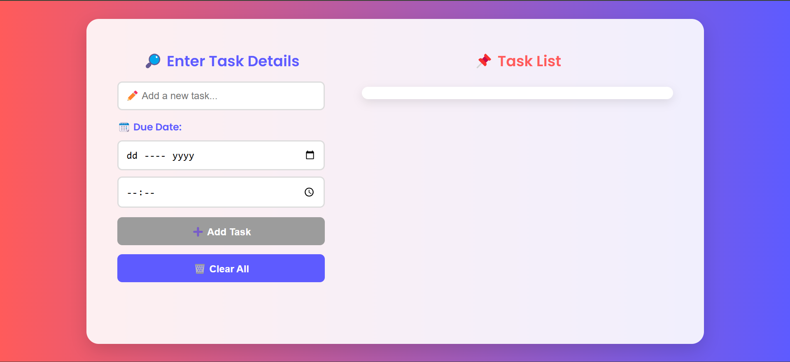

# 📝 To-Do List App  

A simple, elegant, and efficient To-Do List app designed to help you manage your tasks effortlessly. With features like task due dates, editing, sorting, and localStorage persistence, this app ensures that you stay organized and never lose track of your tasks—even after closing your browser.  

## ✨ Features  

✔️ **Add Tasks** – Create new tasks with optional due dates and times  
✔️ **Edit Tasks** – Modify task details dynamically  
✔️ **Mark as Completed** – Strike-through effect for completed tasks  
✔️ **Delete Tasks** – Remove tasks permanently  
✔️ **Sort by Due Date** – Tasks are automatically sorted for better tracking  
✔️ **Persistent Storage** – Uses `localStorage` to keep tasks saved across sessions  
✔️ **Minimalist UI** – Clean, responsive, and easy-to-use interface  

## 🚀 Technologies Used  

- **HTML** – Provides the app's structure  
- **CSS** – Ensures a modern, responsive, and aesthetic UI  
- **JavaScript** – Manages task functionality and local storage  

## 📂 File Structure  

```
📂 To-Do List App
├── index.html       # Main structure of the app
├── styles.css       # Styling for the UI
├── script.js        # JavaScript for interactivity and localStorage handling
└── README.md        # Project documentation
```  

## 📌 How to Use  

1. **Open** `index.html` in a browser.  
2. **Enter** a task name in the input field.  
3. **(Optional)** Set a due date and time for better organization.  
4. **Click** the 'Add' button to create a task.  
5. **Manage tasks**:  
   - Click **Edit** to modify task details.  
   - Click **Delete** to remove a task permanently.  
   - Click **on a task** to mark it as completed (strikethrough effect).  
6. **Refresh-proof**: Tasks are automatically saved in `localStorage`, so they persist even after reloading the page.  

## ⚡ Installation  

No installation needed! Simply:  

1. **Download** or **clone** the repository.  
2. **Open** `index.html` in any web browser.  
3. Start organizing your tasks! 🎯  

## 🔍 Preview  

  

## 📜 License  

This project is licensed under the **MIT License**, allowing you to use, modify, and distribute it freely.  

## 🤝 Contributing  

Have ideas to enhance the project? Fork the repository and submit a pull request! Contributions are always welcome. 💡  

